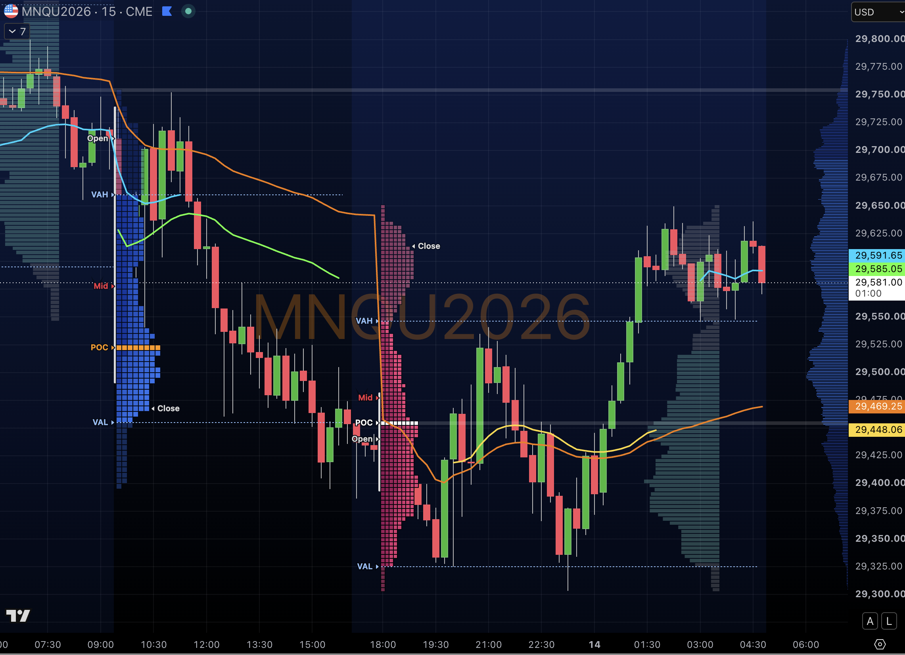
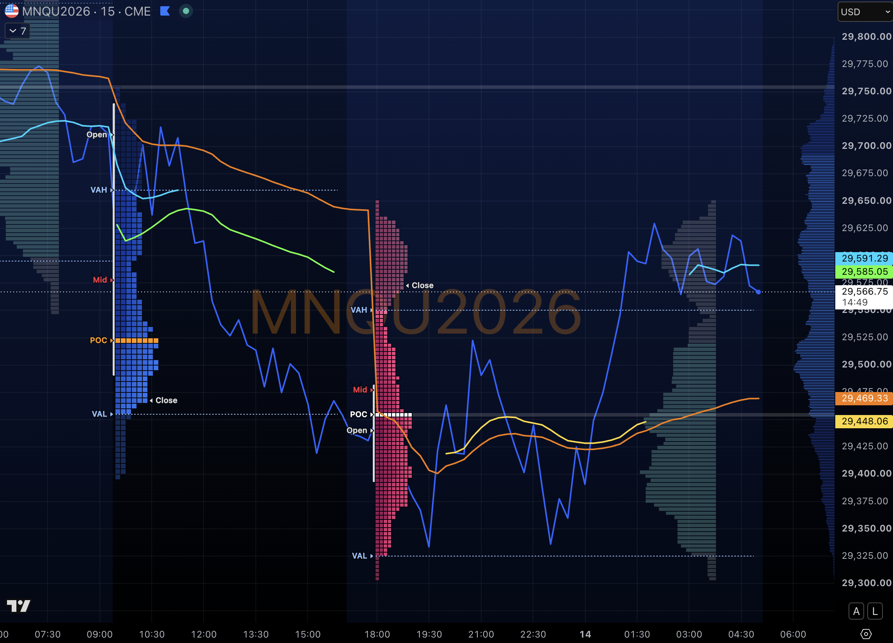

# RTH Session VWAP

A TradingView (Pine Script **v6**) indicator that plots timezone-correct session VWAPs
(New York, London, Asia) plus a continuous 24h/daily VWAP, with optional standard-deviation bands.

Built for intraday futures trading where the chart is viewed from a timezone that differs
from the exchange — the sessions compute in explicit market timezones, so they plot correctly
no matter what timezone your chart is set to (e.g. Manila), and daylight saving is handled
automatically.

- **Website:** https://raoulsson.com
- **Repo:** https://github.com/raoulsson/trading-view-script-rth-session-wvap

## Screenshots

MNQ (Micro E-mini Nasdaq) 15m — session VWAPs with a volume-profile overlay for context.
The NY VWAP anchors to 09:30 ET; the 24h VWAP runs continuously across the trading day.





## Attribution

This is a modified derivative of **"Koalafied VWAP Session/Day"** (published as *Session VWAP*)
by **TJ_667**, released under the Mozilla Public License 2.0. All original credit goes to TJ_667.
This project keeps the same MPL-2.0 license (see [`LICENSE`](./LICENSE)).

## What changed vs. the original

- **Timezone-correct sessions.** Each session is computed in an explicit timezone
  (`America/New_York`, `Europe/London`, `Asia/Tokyo`) via the timezone argument of `time()`.
  The original relied on the chart/exchange timezone, which broke session boundaries when the
  chart was viewed from another timezone. DST is now handled automatically.
- **New York = RTH.** The NY session defaults to the regular cash session, **09:30–16:00 ET**,
  so the NY VWAP anchors to the 09:30 open.
- **Pine v6 migration.** `time()` results (int-or-`na`) are converted to real booleans, since v6
  removed implicit `int`/`float` → `bool` casting; the daily reset uses an explicit boolean
  condition rather than a numeric one.
- **24h VWAP.** An always-on VWAP line anchored to the trading day, drawn independently of the
  session VWAPs.
- **Per-session toggles.** Independent show switches for each session (Asia and London off,
  New York on by default), plus a master switch.
- **Presets.** Line colors and width preset (Asia yellow, London blue, NY green, 24h amber),
  session/daily labels off by default.
- **Clean legend.** All inputs and helper plots are hidden from the status line, so the chart
  legend stays uncluttered while the values remain in the Data Window and Inputs tab.

## Installation

Two ways to get it on your chart:

**A) From TradingView's Indicators library (easiest)**

1. Open TradingView, click **Indicators** in the top toolbar.
2. Search for **"RTH Session VWAP"** and add it to your chart.

**B) From source (this repo)**

1. Grab the Pine code &mdash; either copy the contents of
   [`rth-session-vwap.pine`](./rth-session-vwap.pine) directly, or clone the repo:
   ```
   git clone https://github.com/raoulsson/trading-view-script-rth-session-wvap.git
   ```
2. In TradingView, open **Pine Editor**, paste the code, and click **Add to chart**.
3. If you had a previous version loaded, open the indicator settings and use
   **Defaults → Reset settings** (or remove and re-add) so the presets take effect.

## Settings

- **Display:** master + per-session VWAP toggles, 24h VWAP, daily VWAP, std-dev bands, labels.
- **Calc:** std-dev multipliers, VWAP source, label offset.
- **Sessions:** per-session timezone and session hours.

Session hours are entered in each session's own market timezone (e.g. NY `0930-1600`).

## Notes

- On futures, "24h/Daily" anchors to the exchange trading-day boundary (Globex reset), which is
  the standard daily VWAP anchor.
- Std-dev bands are off by default; enable them under Display.

## License

Mozilla Public License 2.0 — see [`LICENSE`](./LICENSE).
Original © TJ_667. Modifications © 2026 raoulsson.
